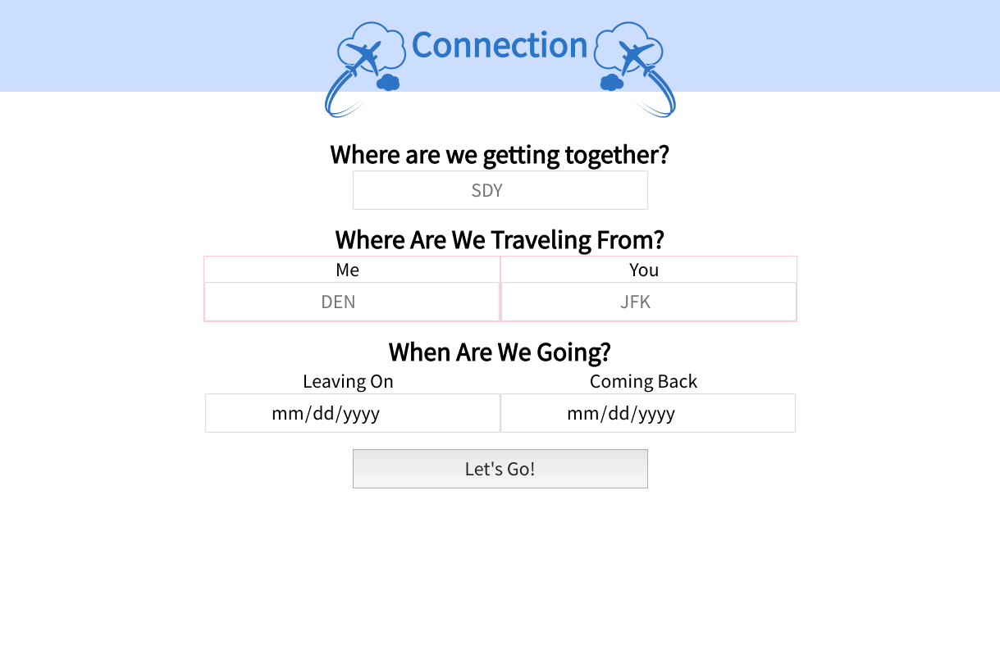
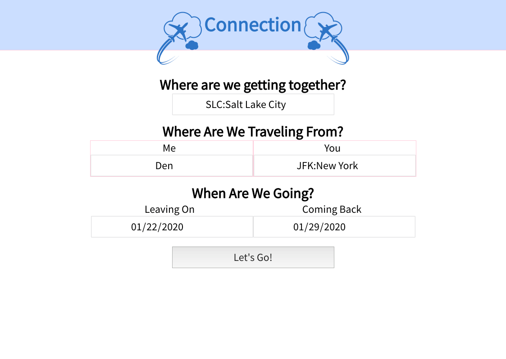

# Connection: An App for two

## Summary

A travel app bringing two people together to a common destination. Connection allows someone to flights from two different cities to siungle destination.


## Collaborators  
- Kirk Veitch - [github account](https://github.com/KVeitch)

## Technology  
- [Hipmunk API]()
- [Unsplash API]()
- React
- Redux
- React Router
- Enzyme/Jest
- JavaScript
- SCSS

## Learning Goals

This was a solo for Mod Three at Turing. The major focus was to further develop our skills utilizing React while learning the new processes of Redux. All while further honing our understanding of network requests with an API and backend. It was extremely important for us to work on our expertise, while focusing on testing as much as possible during the one week project.

## How to download  
### Clone down the frontend

1. Clone down the repo [GitHub Repository Link](https://github.com/KVeitch/get-together)
2. Switch to the cloned directory
3. in your terminal run  
                          ```npm install```
4. Then run   
              ```npm start```
5. Enjoy the travel and the photos!

### Travel Planning





### The Trip


### Original Wireframes

<a href='./DOCS/Binary%20Challenge%20Wireframe.pdf' target='_blank'>Wireframe</a>


